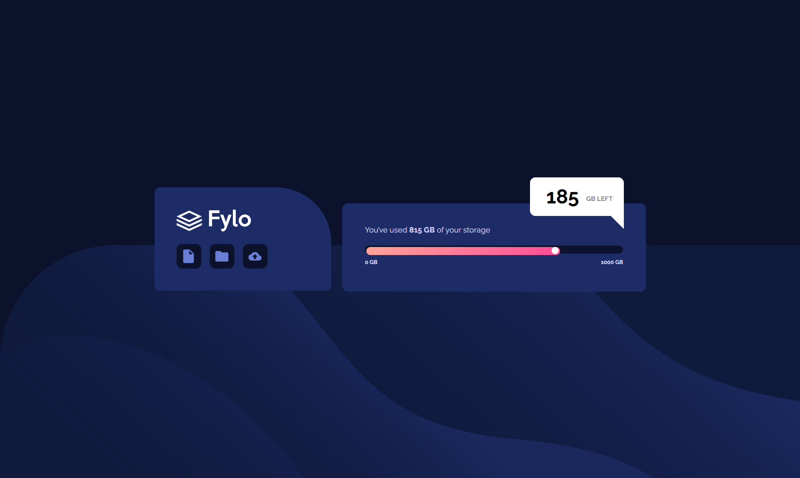
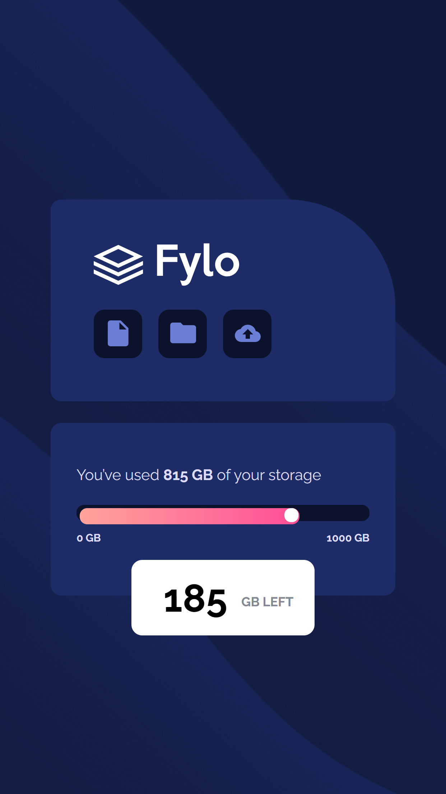

# Frontend Mentor - Fylo data storage component solution

This is a solution to the [Fylo data storage component challenge on Frontend Mentor](https://www.frontendmentor.io/challenges/fylo-data-storage-component-1dZPRbV5n).

## Table of contents

- [Overview](#overview)
  - [The challenge](#the-challenge)
  - [Screenshot](#screenshot)
  - [Links](#links)
- [My process](#my-process)
  - [Built with](#built-with)
  - [What I learned](#what-i-learned)
  - [Useful resources](#useful-resources)
- [Author](#author)

## Overview

### The challenge

Users should be able to:

- View the optimal layout for the site depending on their device's screen size

### Screenshot

<details>
  <summary>💻 Desktop</summary>
  
</details>

<details>
  <summary>📱 Mobile</summary>
  
</details>

### Links

- Live Site URL: [Fylo data storage component](https://your-live-site-url.com)

## My process

### Built with

- Semantic HTML5 markup
- CSS custom properties
- Flexbox
- Mobile-first workflow

### What I learned

I learned hot to use figures on css as well as reinforce my knowledge about align items with flexbox.

Some code snippets:

```html
<div class="usage-left">185<span> GB Left</span></div>
```

```css
.usage-left::after {
  content: '';
  width: 0;
  height: 0;
  display: block;
  border-right: 25px solid white;
  border-top: 25px solid transparent;
  border-bottom: 25px solid transparent;
  position: relative;
  top: -35px;
  left: 145px;
}
```

### Useful resources

- [Ralewey font](https://fonts.google.com/specimen/Raleway) - I used this font to complete my design.

- [Shapes with CSS](https://cybmeta.com/formas-basicas-con-css-triangulos-circulos-trapecios-rectangulos-cuadrados) - I used this resource to learn how to apply border to draw shapes.

## Author

- Frontend Mentor - [@themattfire](https://www.frontendmentor.io/profile/themattfire)
- Github - [@themattfire](github.com/themattfire)
